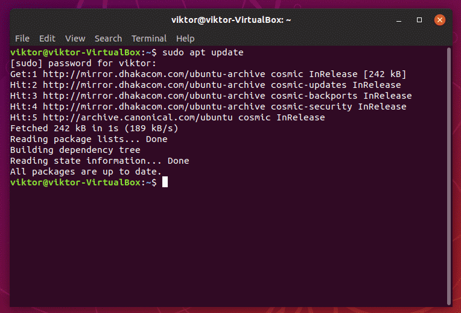

# Simple Shell (Multi-Processing)



## 1. Problem Statement

implement a Unix shell program. A shell is simply a program that conveniently allows you to run other programs. Read up on your favorite shell to see what it does.

shell support the following commands:

1. The internal shell command "exit" which terminates the shell
    * **Concepts**: shell commands, exiting the shell.
    * **System calls**: exit()
2. A command with no arguments
    * **Example**: ls, cp, rm …etc
    * **Details**: Your shell must block until the command completes and, if the return code is abnormal, print out a message to that effect.
    * **Concepts**: Forking a child process, waiting for it to complete and synchronous execution.
    * **System calls**: fork(), execvp(), exit(), waitpid()
3. A command with arguments
    * **Example**: ls –l
    * **Details**: Argument 0 is the name of the command.
    * **Concepts**: Command-line parameters.
4. A command, with or without arguments, executed in the background using &.
    * **Example**: firefox &
    * **Details**: In this case, your shell must execute the command and return immediately, not blocking until the command finishes.
    * **Concepts**: Background execution, signals, signal handlers, processes and asynchronous execution.
    * **Requirements**: You have to show that the opened process will be nested as a child process to the shell program via opening the task manager found in the operating system like the one shown in figure 1. Additionally you have to write in a log file (basic text file) when a child process is terminated (main application will be interrupted by a SIGCHLD signal). So you have to implement an interrupt handler to handle this interrupt and do the corresponding action to it.
5. Shell builtin commands
    * **Commands**: cd & echo
    * **Details**: for the case of:
        * **cd**: Cover all the following cases (**assume no spaces in path**):
            * cd
            * cd ~
            * cd ..
            * cd absolute_path
            * cd relative_path_to_current_working_directory
        * **echo**: Prints the input after evaluating all expressions (**assume input to echo must be within double quotations**).
            * echo "wow" => wow
            * export x=5
            * echo "Hello $x" => Hello 5
6. Expression evaluation
    * **Commands**: export
    * **Details**: Set values to variables and print variables values. No mathematical operations is needed.
    * **Export Details**: Accept input of two forms, either a string without spaces, or a full string inside double quotations.
    * **Example**:
        * export x=-l
        * ls $x => Will perform ls -l
        * export y="Hello world"
        * echo "$y" => Hello world


## 2. Problem Description

1. command shell take the user command and its parameter(s), i.e., “ls” and “–l” in this example, and convert them into C strings. (Recall that a C string terminates with a null string, i.e., \0.)
2. The command shell create a child process via **fork()**.
3. The child process passes the C strings—the command and parameter(s)—to **execvp()**.
4. The child exits if **execvp()** returns error.
5. The parent process, i.e., the command shell, waits, via [waitpid(pid_t pid, int *statusPtr, int options)](https://support.sas.com/documentation/onlinedoc/sasc/doc/lr2/waitpid.htm) , for the child process to finish.
6. The command shell gets the next command and repeats the above steps. The command shell terminates itself when the user types exit.

In case a user wants to execute the command in background (i.e. as a background process), he/she writes & at the end of the command. For example, a user command can be:

```Shell
firefox &
```

In this case, command shell do not wait for the child by skipping the Step 5.

A log file (basic text file) for shell program whenever a child process terminates, the shell program appends the line “Child process was terminated” to the log file. To do this, A signal handler appends the line to the log file when the SIGCHLD signal is received.

## Pseudocode

```Pseudocode
function parent_main()
    register_child_signal(on_child_exit())
    setup_environment()
    shell()


function on_child_exit()
    reap_child_zombie()
    write_to_log_file("Child terminated")


function setup_environment()
    cd(Current_Working_Directory)


function shell()
    do
        parse_input(read_input())
        evaluate_expression():
        switch(input_type):
            case shell_builtin:
                execute_shell_bultin();
            case executable_or_error:
                execute_command():

    while command_is_not_exit


function execute_shell_bultin()
    swirch(command_type):
        case cd:
        case echo:
        case export:


function execute_command()
    child_id = fork()
    if child:
        execvp(command parsed)
        print("Error)
        exit()
    else if parent and foreground:
        waitpid(child)
```
